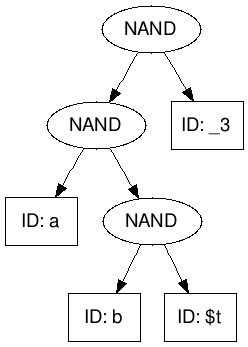

# PA4-BoolSAT (Status: Posted 9/16/18 1 pm)

For PA4, you will be writing a program that reads in a boolean expression from a file and then
determines if it is ever possible for that expression to be satisfiable (evaluate to true).
This will have you writing unit tests for some provided expression parsing code, writing code
that evaluates provided boolean expression trees, and exhaustively searching all possible
assignments of boolean values to the variables in the given boolean expression.

There is a lot of information about writing JUnit test cases in this writeup, so it is
longer than the previous programming assignment writeups.

## Learning Objectives
The goal of this assignment is to practice the following ideas:

 - Understanding how a large problems is decomposed into classes.
 - Using JUnit to test the interface to those classes.
 - Traversal over trees and post-order evaluation of expressions.
 - More exhaustive search using recursive backtracking.
 - Multiple data structures being used at the same time (tree and map of variables to bool values)

For this assignment you have been provided classes that build syntax trees from boolean 
expression strings.  The bool_exp package contains all of the source code for this library.

NOTE: **You do not need to modify any of the files in the bool_exp package.**
We will be testing your code with the original versions of the bool_sat/\* files.


## Background (What is this SAT thing?)
The [SAT](https://en.wikipedia.org/wiki/Boolean_satisfiability_problem) problem is historically
significant in that it was the first problem proven to be
[NP-complete](https://en.wikipedia.org/wiki/NP-completeness). A cool property of the NP-complete
class of problems is that ANY NP-complete problem can be rewritten as the SAT problem, and vice-versa.
Usually this conversion is pretty easy. There are a lot of really important problems in the
NP-complete class. In fact, SAT is so important that there are yearly competitions to see who can
create the best SAT solver (\[[1](http://www.satcompetition.org/)\], \[[2](http://www.maxsat.udl.cat/)\]).
SAT has no known efficient solution (i.e. a solution in polynomial time, in the worst case SAT is on
the order of ​).

Some uses to SAT solvers:
- [Using SAT to synthesize programs](https://www.ncbi.nlm.nih.gov/pmc/articles/PMC5597726/).  Yes,
that is “synthesis” as in have the computer write programs!
- [Eclipse embeds SAT4j to manage dependencies among its plugins.](https://stackoverflow.com/questions/9377916/what-is-sat-and-what-it-is-good-for)
- [Applied to a flash game called Hexoim](https://github.com/hugomg/hexiom).


## The Assignment (What you will be doing)

For this assignment, you will be exhaustively searching all possible assignments of boolean
values to variables  and determining if the expression is satisfiable. An expression is
satisfiable if there exists at least one mapping from variables to boolean values such that
the expression evaluates to true. Such a mapping (where every variable is given exactly
one value from {true, false}) will be called a 'configuration' in this document.

For example:
```
    a NAND a
```
Can the expression `a NAND a` have any assignment of 'a' that results in a true value for the
expression?

The answer is: Yes.

If a is ```false``` then (```false NAND false```) is true.

If on the other hand all possible boolean assignments to variables in the expression
result in the expression being false, then the expression is unsatisfiable.

The input to your program will be a boolean expression of variables and NAND operations.
See PublicTestCases/\*.in for example input files.


## The BoolSAT Package
You are provided with a number of classes in bool_sat/\*.  See the file headers
in these .java files to see how they can be used.  PA4ReadInputWriteDot.java
will be especially useful, because it shows how to use the provided 
BoolSatParser.parse() function to turn a string from the input file into a
tree representing the expression.

Given boolean logic expressions we can
construct trees to represent the expressions. See PA4ReadInputWriteDot.java
to see how this is done; here is an example expression tree:

Input: ```a NAND (b NAND $t) NAND _3```


Output:

​

## Task #1 - JUnit Testing (You need to do this)
We have done some preliminary main-method testing in the Parser class and Lexer class
in the BoolSat library. You need to help us out by writing JUnit tests for the ASTNode class.

In ``ASTNodeTest.java`` you should, at a minimum, test the following **for each node type** using JUnit:

 - Creating nodes with `null` children.
 - Creating nodes with other ASTNodes as children.
 - The `isNand` and `isId` methods on nodes that are the correct type and incorrect type.
 - Getting the name of the identifier in an ID node.

### JUnit Test Cases

Each feature being tested should be in its own test case. A JUnit test cases is a method of 
the form (see all previous Drills for more examples):
```
@Test
public void testFeatureMath() {
        Integer i = new Integer(1);
        Assert.assertEquals(i.intValue(), 1);
        Assert.assertTrue(5 + 1 == 6);
        Assert.assertFalse(5 * 4 == 4);
        ...
}
```
The `Assert` class provides methods for testing expected behavior. If any assertion does
not pass, the test case will fail and Eclipse will display information about which test
cases pass and, if any fail, on which assertion they failed.

Here, two of my test cases failed because my ASTNode class was not implemented correctly:


Once I fixed the mistake, my test cases all passed:


NOTE: You should not change the implementation of the ASTNode class. All you need to do is
write a set of test cases that verify it behaves correctly.

As a thought experiment, how could you rewrite the main-method test cases of 
BoolSatParser.java and Lexer.java into JUnit test cases?

## Task #2 - The SAT[isfiability] Problem (You need to do this)
Implement a program in `PA4BoolSat.java` that:
 1. Constructs an Abstract Syntax Tree for the expression in the input file provided by the
 first command line argument (`args[0]`).
 2. Optionally accepts a DEBUG command line option in the second command line argument.
 3. Exhaustively searches over all possible assignments of values to each boolean variable. If
 the DEBUG option is set: print all configurations and the result evaluating the expression with
 those variable values. If the DEBUG option is not set, print all configurations that satisfy the expression.

### Expression input file:
The expression input file should contain only a single line, that line should contain a well-formed
Java boolean expression limited to:
 - the NAND operator `NAND`
 - and valid Java identifiers: i.e strings with no spaces that start with exactly one letter, or `$`,
 or `_`, that is followed by any number of letters, digits, `$` and `_` characters
 - and expressions in parentheses

  ```
Input File:
----------------------------------
| a NAND (b NAND $t) NAND _3     |
|             ...                | <all other lines ignored>
----------------------------------
```

This description is taken from PA4ReadInputWriteDot.java -- an example of what the file usage documentation for the code
you write should look like.

### Output Format (DEBUG not enabled):
For the above expression, the output should be the following:
```
input: a NAND (b NAND $t) NAND _3
SAT
$t: false, _3: false, a: false, b: false
$t: false, _3: false, a: false, b: true
$t: false, _3: false, a: true, b: false
$t: false, _3: false, a: true, b: true
$t: false, _3: true, a: true, b: false
$t: false, _3: true, a: true, b: true
$t: true, _3: false, a: false, b: false
$t: true, _3: false, a: false, b: true
$t: true, _3: false, a: true, b: false
$t: true, _3: false, a: true, b: true
$t: true, _3: true, a: true, b: false
```

To match the expected output you need to convert each satisfying configuration into a single
line string. The String representation should be of the form

`identifier0: value0, identifier1: value1, ..., identifierN: valueN`

such that `identifier0` , `identifier1`, ..., `identifierN` are sorted in alphabetic order.

Lastly; there may be many such configurations that satisfy an expression, each line that is output
should be sorted (see example output).  The output is sorted by the the configuration strings themselves.
(HINT: create some kind of collection of configuration strings and print them out in sorted
order).

### Output Format (DEBUG enabled):
When the DEBUG command is provided to the program, you should print out all configurations and
the value that the expression evaluates to with each configuration as input. Print the configuration
in the same format as above, and append `", result"` to the end (where `result` is `true` or `false`
depending on how the configuration evaluates the expression).

Using the same example as above, the output would be:
```
input: a NAND (b NAND $t) NAND _3
SAT
$t: false, _3: false, a: false, b: false, true
$t: false, _3: false, a: false, b: true, true
$t: false, _3: false, a: true, b: false, true
$t: false, _3: false, a: true, b: true, true
$t: false, _3: true, a: false, b: false, false
$t: false, _3: true, a: false, b: true, false
$t: false, _3: true, a: true, b: false, true
$t: false, _3: true, a: true, b: true, true
$t: true, _3: false, a: false, b: false, true
$t: true, _3: false, a: false, b: true, true
$t: true, _3: false, a: true, b: false, true
$t: true, _3: false, a: true, b: true, true
$t: true, _3: true, a: false, b: false, false
$t: true, _3: true, a: false, b: true, false
$t: true, _3: true, a: true, b: false, true
$t: true, _3: true, a: true, b: true, false
```

## Testing your program
Upload it to Gradescope and you will be able to see
which public and grading test cases were passed/failed.

We STRONGLY recommend you put some of your own test cases in PublicTestCases/
and test those in Eclipse.
Also look at the examples that are already in the PublicTestCases/ subdirectory.
As with previous assignments, the input filename and command line options
are encoded in the .out files.


## Getting Started
### JUnit Background Information 
Writing software is hard. Plain and simple, programming is not easy. Over the past 
70 years there have been many methods developed to make the process of writing code 
easier. Once such technique is called **Test-Driven Development**. The idea is 
simple: you know what you want your code to do, but you do not know how to write 
code to do it. So start by writing the test cases, then write code that makes those 
test cases pass. Test-Driven Development is used in industry, and you will most probably
do it in CS335. In Java, JUnit is a framework that allows us to write test cases with 
ease and automate the testing process.  Our goal is to introduce you to JUnit to 
help you test the code you write better.

### Code
To use JUnit, each test case (a single method defined 
like the one below) should be responsible for testing one piece of functionality. 
```
@Test
public void testOneThing() {
}
```
You will also need to import some classes:
```
import static org.junit.Assert.assertEquals;
import static org.junit.Assert.assertTrue;

import org.junit.Test;

```

### Testing Thought Process
This is the process you need to follow when writing test cases:

 1. **THINK** about what needs to happen. "When I call this method what should it do?"
 2. **THINK** about what the correct output should be for a particular input. 
 "When I call this method with x and y as input, what should the output be?"
 3. **WRITE CODE** in the test case that creates these inputs, and feeds them into the code being tested.  
 4. **WRITE CODE** in the test case to ensure that the actual result was correct. 
 The actual output from the code being tested should match the expected output that we 
 hypothesized in (2). Use the Assert class that JUnit provides. 

[The JUnit Assert class documentation](https://junit.org/junit4/javadoc/latest/org/junit/Assert.html) 
lists all of the assert methods that can be used to test expected output vs actual output. 
Some of the most useful are `assertTrue()`, `assertFalse()`, `assertEquals()`, `assertNull()`, etc. 

### Example
For example, the Java standard library has a Math class to do various math operations. Let's apply 
this testing process to test the math class. 

 1. (Thinking) The `Math.min(int a, int b)` method should return the smaller of the two input numbers. 
 2. (Thinking) The `min` method accepts two numbers as input, and returns the smaller one. If I provide 
 that method 55 and 77, the output should be 55. 
 3. (Writing) Write the code to set up this scenario:
```
@Test
public void testMath() {
    int small = 55, big = 77;
    int result = Math.min(small, big);
}
```
 4. (Writing) We haven't actually tested anything yet. Since the expected output is 55, if Math.min() 
 is implemented correctly that is what the value of `result` should be. So we write an assert to test 
 the expected output against the actual output. 
```
@Test
public void testMath() {
    int small = 55, big = 77;
    int result = Math.min(small, big);
    Assert.assertEquals(result, 55); 
}
```

If `Math.min()` is not implemented correctly, then the test case would fail. If we have lots and 
lots of test cases and they all pass, we can be reasonably certain that the method is implemented correctly.

### Assignment Hint
You need to test all of the functionality of the ASTNode.java class. **Your first step should be reading 
every line of code in that class (it's a small class) and understanding what it does.** How can you test 
something if you don't know what it is supposed to be doing? If you have questions about how it is implemented,
ask on Piazza. Then follow the 4 steps above. Let's do another example using the ASTNode.java class.

 0. **READ THE CODE** It looks like the class only has two public instance variables, child1 and child2. 
 It looks like there are only pubic methods for creating nodes, testing if a given node is of a particular 
 type, and getting the name of an identifier node's variable. 
 1. **THINK** NAND nodes have two children.
 2. **THINK** If I create a NAND node with the two children set to null, the child1 and child2 instance 
 variables should both probably be null.
 3. **WRITE CODE** Let's create an NAND node with null children.
```
@Test
public void testAnd(){
    ASTNode testAnd = ASTNode.createNandNode(null, null);
}
```
 4. **WRITE CODE** Let's test that the values are what they should be.
```
@Test
public void testNnd(){
    ASTNode testNand = ASTNode.createNandNode(null, null);
    Assert.assertNull(testNand.child1);
    Assert.assertNull(testNand.child2);
}
```
Once you have finished (4), go back to (1) and repeat until you have tested all of the 
functionality of the class. In the Task #1 criteria I list 5 different functionalities 
to test for. We have done the first bullet point for only the NAND node. You should do 
this same bullet point for the other kinds of nodes. 

Also see all of the provided Drill\*Test.java code to see more examples of using JUnit.


### BoolSat Package

The file bool_exp/PA4ReadInputWriteDot.java is an example application for using the BoolSatParser. 
This file reads an input expression from a file, and creates a string in the DOT format 
representing the structure of the expression tree. That string can be fed as input to a 
[DOT to Image utility](http://sandbox.kidstrythisathome.com/erdos/) to see a picture of 
the structure of the tree. 

**You will need to write code similar to how PA4ReadInputWriteDot is written**, you will 
need to read an expression from an input file, and pass it to `BoolSatParser.parse(String expression)`. 
This method will return an ASTNode that is the root of an expression tree. 

## Grading Criteria

Half of the PA4 grade will be correctness.  For this assignment, there
will be some private test cases on Gradescope.

The other half of the PA4 grade will be your decomposition and code clarity,
the JUnit tests, and a peer review.

Decomposition
* Should carefully select data structures that implement the
  required functionality.  For example, if you avoid using Maps,
  it will probably result in more complicated code and thus points off.

* Should just use JUnit methods in ASTNodeTest.java and static methods in PA4BoolSat.java.

* Use a single file for Task#2, PA4BoolSat.java.  This should be a small program (<250 lines)
  not counting the file header.

* Each static method should be less than 30 lines.  This INCLUDES
  comments but it does not include the method header.  It is easier to 
  read a function if it can all fit on one screen.

* Make things as simple as possible.
  * Only use one Scanner instance.
  * Don't use lambda functions or other features in non-standard ways.
  * Reduce the amount of conditional nesting as much as possible.

* Declare collection variables using interface types.

* Your code should be decomposed well. `main` should be a good summary of your 
  program and no method should be overly long or trivial. Your methods should 
  not be chained. Do NOT have main just call one method that does everything.

* Redundancy is a grading focus; some tasks are similar in behavior or based 
  off of other tasks. You should avoid repeated logic as much as possible.

Code Clarity
* YOU should be able to read, understand, and explain your own code
to someone else a couple days after you wrote it.
  * No magic numbers
  * No methods written to just get the test cases to work

* There needs to be a balance between no comments in the body of the
methods and a comment for every line in the program.  Either extreme
will result in points off.

* The file header should include instructions on how someone would
use this program.  To use the program, one would need to know the
input file format.

* Use meaningful variable names and camel case.  Loop iterators can
be simple (i for integers, s for strings, n for numbers, etc.).

* We will be modeling some of the issues we are seeing with code.

* We will ask permission to show clear code examples.

The coding style in terms of spacing, etc. should be done automatically
every time you save in Eclipse.  As long as you stick with those defaults,
the syntax style should be fine.  At workplaces the style requirements
can be extensive.  In this class, we have the following requirements:
  1. No lines should be longer than 80 characters line.
  2. Do not mix tabs and spaces.  Use spaces consistently.
  3. The left curly brace should start on the same line as the loop or conditional.

Write your own code.  We will be using a tool that finds overly similar code.
we recommend that when talking with others about the assignment, do not write
anything down.

## Submission

For PA4, you are required to submit your PA4BoolSat.java and ASTNodeTest.java file to Gradescope.

*(NEW)* You are also required to submit an anonymized PA4BoolSat.java to Aropa for 
peer review.  Log into https://aropa2.gla.ac.uk as was done during Section 3.
